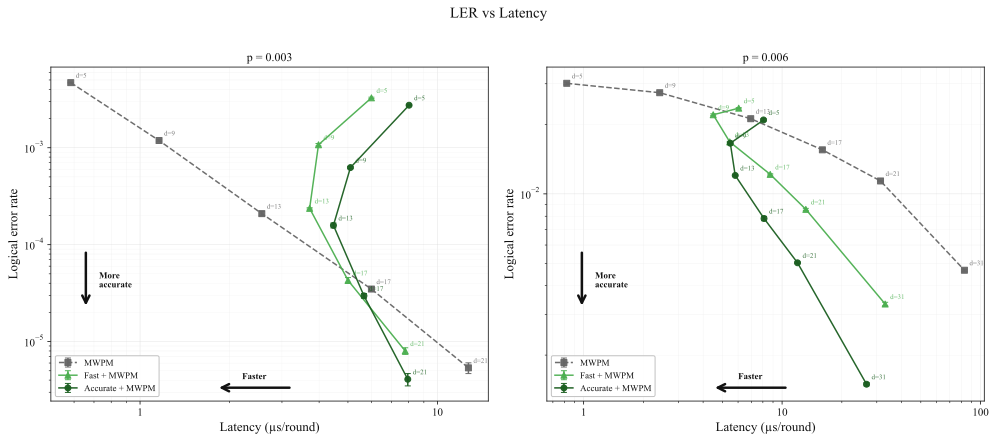

# Ising 解码

[](./LICENSE)
[](https://github.com/NVIDIA/Ising-Decoding/tree/releases/v0.1.0)
[](https://research.nvidia.com/publication/2026-04_fast-ai-based-pre-decoders-surface-codes)
[](https://www.python.org/downloads/)
[](https://huggingface.co/nvidia/Ising-Decoder-SurfaceCode-1-Fast)
[](https://huggingface.co/nvidia/Ising-Decoder-SurfaceCode-1-Accurate)

本仓库提供了 AI 训练框架与配方，用于构建、定制和部署可扩展的量子纠错 **解码器**：

- 神经网络在空间 **和** 时间维度上消费探测器综合征（detector syndromes）
- 它预测校正项，以降低综合征密度 / 改善解码效果
- 标准解码器（PyMatching）给出最终的逻辑判决

公开版本提供了 **一个面向用户的配置文件** 和 **一个统一的运行脚本**。


## 目录

- [论文](#论文)
- [高层工作流](#高层工作流)
- [快速开始（训练 + 推理）](#快速开始训练--推理)
- [依赖项](#依赖项)
- [故障排查](#故障排查)
- [推理（预训练模型）](#推理预训练模型)
- [模型导出与下游工具](#模型导出与下游工具)
  - [将 .pt 检查点转换为 SafeTensors](#将-pt-检查点转换为-safetensors可选训练后)
  - [ONNX 导出与量化](#onnx-导出与量化可选训练后)
  - [为 CUDA-Q QEC 生成数据](#为-cuda-q-qec-生成数据实时预解码器测试应用)
  - [使用 cudaq-qec 进行解码器消融研究](#使用-cudaq-qec-进行解码器消融研究可选)
- [配置与高级用法](#配置与高级用法)
  - [GPU 选择](#gpu-选择)
  - [公开配置](#公开配置-confconfig_publicyaml)
  - [预计算帧](#预计算帧推荐)
  - [恢复训练与在已训练模型上运行推理](#恢复训练与在已训练模型上运行推理)
- [日志与输出](#日志与输出)
  - [输出写入位置](#输出写入位置)
  - [评估默认值](#评估默认值公开发布版)
- [测试与 CI](#测试与-ci)
  - [测试（CPU + GPU）](#测试cpu--gpu)
  - [CI（GitHub Actions）](#cigithub-actions)
- [结果](#结果)
- [许可证](#许可证)

## 论文

本实现配套论文如下：

Christopher Chamberland、Jan Olle、Muyuan Li、Scott Thornton 和 Igor Baratta，
“Fast and accurate AI-based pre-decoders for surface codes,”
[arXiv:2604.12841](https://arxiv.org/abs/2604.12841)，2026。
[doi:10.48550/arXiv.2604.12841](https://doi.org/10.48550/arXiv.2604.12841)

如果你在研究或已发表工作中使用了本仓库，请引用该论文。

## 高层工作流

```text
 ┌────────────────────────────────────────┐  用途：
 │ 1. 训练或下载模型                      │  - Ising-Decoding 仓库（训练）
 │                                        │  - Hugging Face（下载）
 └──────────────────┬─────────────────────┘
                    │
                    ▼
 ┌────────────────────────────────────────┐  用途：
 │ 2. 评估性能                            │  - Ising-Decoding 仓库
 │    （运行推理测试）                    │
 └──────────────────┬─────────────────────┘
                    │
 ┌──────────────────▼─────────────────────┐  用途：
 │ 3. 研究实时性能                        │  - Ising-Decoding 仓库（3a, 3b）
 │                                        │  - CUDA-Q QEC（3c）
 │   ┌────────────────────────────────┐   │
 │   │ 3a. 启用 ONNX_WORKFLOW 并      │   │
 │   │     选择量化格式               │   │
 │   └──────────────┬─────────────────┘   │
 │                  │                     │
 │   ┌──────────────▼─────────────────┐   │
 │   │ 3b. 运行 generate_test_data.py │   │
 │   └──────────────┬─────────────────┘   │
 │                  │                     │
 │   ┌──────────────▼─────────────────┐   │
 │   │ 3c. 将 .onnx 和 .bin 文件导入  │   │
 │   │     CUDA-Q QEC                 │   │
 │   └────────────────────────────────┘   │
 └────────────────────────────────────────┘
```

## 快速开始（训练 + 推理）

在仓库根目录下：

- `code/scripts/local_run.sh`

该脚本会在本地运行 Hydra 工作流（无需 SLURM），并读取 **一个** 面向用户的配置文件：

- `conf/config_public.yaml`

## 依赖项

目标 Python 版本：**3.11、3.12、3.13**。

提供了两个最小依赖文件：

- `code/requirements_public_inference.txt`（Stim + PyTorch 推理路径）
- `code/requirements_public_train-cuXY.txt`（训练路径，其中 XY = 12 或 13）

安装示例（虚拟环境可选，但推荐使用）：

```bash
# 可选：创建并激活虚拟环境
python -m venv .venv
source .venv/bin/activate

# 可选：安装带 CUDA 支持的 PyTorch（示例：任选一个可用的 cuXXX）
# 选择与你的 CUDA 运行时匹配的版本；已知 cu130 可正常工作。
export TORCH_CUDA=cu130

# 仅推理（训练安装包含其所有依赖）
pip install -r code/requirements_public_inference.txt

# 训练（包含推理依赖，请按需调整为 cu13）
pip install -r code/requirements_public_train-cu12.txt

bash code/scripts/check_python_compat.sh
```

提示：若要强制使用带 CUDA 的 PyTorch，请在安装前设置 `TORCH_CUDA=cuXXX`（推荐 `cu13x`）或
`TORCH_WHL_INDEX=https://download.pytorch.org/whl/cuXXX`。

快速开始：

```bash
# 训练（读取 conf/config_public.yaml）
bash code/scripts/local_run.sh

# 推理（从 outputs/<exp>/models/* 加载已保存模型）
WORKFLOW=inference bash code/scripts/local_run.sh
```

推理说明：

- 在裸机环境中，保留默认的 DataLoader worker 数量。
- 在容器中，设置更大的共享内存大小（例如 `docker run --shm-size=1g ...`）。
- 如果无法修改 `--shm-size`，设置 `PREDECODER_INFERENCE_NUM_WORKERS=0` 以避免共享内存 worker 崩溃。
- 默认评估负载较重（每个 basis 的 `cfg.test.num_samples=262144` 次采样）；预计推理需要较长时间。

## 故障排查

- **避免在短时间运行中使用 `steps_per_epoch=0`**：
  - 保持 `PREDECODER_TRAIN_SAMPLES >= per_device_batch_size * accumulate_steps * world_size`。
  - 注意：batch 调度会在 epoch 0 后跳到 2048，因此 epoch 1 使用的有效 batch size 为
    `2048 * 2 * world_size`。
  - 对于快速短跑测试，使用 `GPUS=1` 且 `PREDECODER_TRAIN_SAMPLES >= 4096`。
- **训练启动期间发生段错误（`torch.compile`）**：
  - 某些环境会在 `torch.compile` 期间崩溃。
  - 禁用 compile：`TORCH_COMPILE=0 bash code/scripts/local_run.sh`。
  - 或尝试更安全的模式：`TORCH_COMPILE=1 TORCH_COMPILE_MODE=reduce-overhead bash code/scripts/local_run.sh`。
- **Blackwell GPU（RTX 5080/5090、GB200/GB300）**：
  - 稳定版 PyTorch wheel（`cu124`）不包含 SM 12.0 kernel。
    请使用 `cu128` 索引安装 nightly 版本：
    ```bash
    pip install --pre torch --index-url https://download.pytorch.org/whl/nightly/cu128
    ```
- **Windows（Git Bash / WSL）**：
  - Triton 不支持原生 Windows，因此会导致 `torch.compile` 失败。运行前请禁用：
    ```bash
    export TORCH_COMPILE_DISABLE=1   # PyTorch 层级开关
    # 或者，对仓库脚本来说等价的是：
    export PREDECODER_TORCH_COMPILE=0
    ```
  - 当直接运行脚本时（不通过 notebook 或 `local_run.sh`），
    设置 Python 路径以确保可导入仓库模块：
    ```bash
    export PYTHONPATH="code"
    ```
- **推理期间找不到预训练模型**：
  - `find_best_model` 会优先在 `{output}/models/best_model/` 中搜索，
    然后回退到 `{output}/models/`。如果你将下载的
    `.pt` 文件放在其他位置，请将其移动到上述目录之一，
    或直接显式指定路径：
    ```bash
    PREDECODER_MODEL_CHECKPOINT_FILE=path/to/Ising-Decoder-SurfaceCode-1-Accurate.pt \
      WORKFLOW=inference bash code/scripts/local_run.sh
    ```

## 推理（预训练模型）

如果你不在本地训练，也可以使用预训练模型运行推理。

1. **（可选）创建虚拟环境并安装推理依赖**：

   ```bash
   python -m venv .venv
   source .venv/bin/activate
   python -m pip install --upgrade pip
   pip install -r code/requirements_public_inference.txt
   ```

2. **获取预训练模型**
   本仓库附带两个预训练模型文件（通过 Git LFS 跟踪）：
   - `models/Ising-Decoder-SurfaceCode-1-Fast.pt`（感受野 R=9）
   - `models/Ising-Decoder-SurfaceCode-1-Accurate.pt`（感受野 R=13）

   这些检查点针对公开配置中编码的统一电路级去极化设置。
   下方流水线支持训练自定义、非均匀的 25 参数噪声模型；
   但那属于训练时定制，而不是这些随仓库分发的检查点本身的属性。

   克隆后可通过 `git lfs pull` 获取这些文件。可选地，当文件不在工作树中时
   （例如最小化 checkout 或 CI），可设置 `PREDECODER_MODEL_URL` 为 LFS/raw URL 以拉取文件。

3. 设置：

   - `EXPERIMENT_NAME=predecoder_model_1`
   - 在 `conf/config_public.yaml` 中设置 `model_id: 1`

4. **运行推理**：

   ```bash
   WORKFLOW=inference EXPERIMENT_NAME=predecoder_model_1 bash code/scripts/local_run.sh
   ```

推理输出会写入 `outputs/<EXPERIMENT_NAME>/`，完整日志位于
`outputs/<EXPERIMENT_NAME>/run.log`。

## 模型导出与下游工具

### 将 .pt 检查点转换为 SafeTensors（可选，训练后）

默认情况下，训练会在 `outputs/<EXPERIMENT_NAME>/models/` 下生成 `.pt` 检查点，推理可直接加载。导出为 SafeTensors 是可选的——当下游工具需要 SafeTensors 格式时再使用。

**步骤 1 — 转换最佳训练检查点：**

```bash
PYTHONPATH=code python code/export/checkpoint_to_safetensors.py \
    --checkpoint outputs/<EXPERIMENT_NAME>/models/<checkpoint>.pt \
    --model-id <MODEL_ID> [--fp16]
```

输出会写到检查点旁边（例如 `<checkpoint>_fp16.safetensors`）。

**步骤 2 — 从 SafeTensors 文件运行推理：**

```bash
PREDECODER_SAFETENSORS_CHECKPOINT=outputs/<EXPERIMENT_NAME>/models/<checkpoint>_fp16.safetensors \
WORKFLOW=inference bash code/scripts/local_run.sh
```

`MODEL_ID` 是公开模型标识符（1–5）；映射关系见 `model/registry.py`。
公开的预训练模型中，`--model-id 1` 对应（R=9），`--model-id 4` 对应（R=13）。

### ONNX 导出与量化（可选，训练后）

训练完成后（或从随仓库附带的 `.safetensors` 文件开始），你可以将模型导出为
ONNX，并可选地应用 INT8 或 FP8 训练后量化以便部署。

你还可以在推理时修改 surface code distance 和 rounds 数量。
也就是说，当改变这两个参数中的任意一个时，**不需要** 重新训练新模型；
由于该模型是 3D 卷积神经网络，模型只会在新的解码体积上运行。

- 若要使用新的 distance，只需在下面命令中添加 `DISTANCE=<your distance>`。
- 若要使用新的 rounds 数量，只需在下面命令中添加 `N_ROUNDS=<your number of rounds>`。

在使用 `local_run.sh` 运行推理前，设置 `ONNX_WORKFLOW` 以及（可选）
`QUANT_FORMAT`、`DISTANCE`、`N_ROUNDS` 环境变量：

| `ONNX_WORKFLOW` | 行为 |
|---|---|
| `0`（默认） | 仅执行 PyTorch 推理，不导出 ONNX |
| `1` | 导出 ONNX 模型，并使用 PyTorch 运行推理 |
| `2` | 导出 ONNX 模型，并通过 TensorRT 运行推理 |
| `3` | 加载已有 TensorRT engine 文件并运行推理 |

```bash
# 仅导出 ONNX（不使用 TensorRT）
ONNX_WORKFLOW=1 WORKFLOW=inference bash code/scripts/local_run.sh

# 导出 ONNX + 应用 INT8 量化 + 运行 TensorRT 推理
ONNX_WORKFLOW=2 QUANT_FORMAT=int8 WORKFLOW=inference bash code/scripts/local_run.sh

# 导出 ONNX + 应用 FP8 量化 + 运行 TensorRT 推理
ONNX_WORKFLOW=2 QUANT_FORMAT=fp8 WORKFLOW=inference bash code/scripts/local_run.sh

# 使用预先构建的 TensorRT engine（跳过导出）
ONNX_WORKFLOW=3 WORKFLOW=inference bash code/scripts/local_run.sh
```

**量化变量：**

| 变量 | 默认值 | 说明 |
|---|---|---|
| `QUANT_FORMAT` | 未设置 | `int8` 或 `fp8`。未设置表示不量化（FP32 ONNX）。 |
| `QUANT_CALIB_SAMPLES` | `256` | INT8/FP8 训练后量化的校准样本数。 |

**电路变量：**

| 变量 | 默认值 | 说明 |
|---|---|---|
| `CONFIG_NAME` | `config_public` | 使用 `conf/$CONFIG_NAME.yaml` 文件中的默认值 |
| `DISTANCE` | 使用 `conf/$CONFIG_NAME.yaml` 中指定的 distance | surface code 距离 |
| `N_ROUNDS` | INT8/FP8 训练后量化的校准样本数。 | memory 实验中的 rounds 数 |

说明：

- TensorRT 工作流（`ONNX_WORKFLOW=2` 或 `3`）要求安装 `tensorrt` 和 `modelopt`。
- FP8 量化失败会导致任务失败。INT8 量化失败则会静默回退到 FP32 ONNX 模型。
- ONNX 和 engine 文件会写入当前工作目录。
- `ONNX_WORKFLOW` 同样适用于 `decoder_ablation` 工作流——见下文。

### 为 CUDA-Q QEC 生成数据（实时预解码器测试应用）

当你在端到端下游系统（例如 CUDA-Q Realtime）中评估神经预解码器时，
你需要一个带有有效输入的测试工具链——既包括导出的神经网络模型，
也包括对应的综合征数据。

提供了工具脚本 `code/export/generate_test_data.py`，用于生成这些精确数据
（包括一个 `.onnx` 文件和若干 `.bin` 文件），从而便于在 CUDA-Q QEC
实时 AI 解码器中使用。

> **重要：** 传给该脚本的 `--distance` 和 `--n-rounds` 参数，
> **必须与** 前一节运行 ONNX 导出时使用的值一致（例如 `ONNX_WORKFLOW=2`）。

有关如何将这些文件导入 CUDA-Q Realtime C++ 流水线的详细说明，
请参阅下游文档：[Realtime AI Predecoder
Pipeline](https://nvidia.github.io/cudaqx/examples_rst/qec/realtime_predecoder_pymatching.html)。

```bash
python3 code/export/generate_test_data.py --distance 13 --n-rounds 104 --num-samples 10000 --basis X --p-error=0.003 --simple-noise
```

**输出示例：**

```text
Building circuit: D=13, T=104, basis=X, rotation=XV, p=0.003
  Circuit built in 0.007s
Building detector error model and PyMatching matcher...
  DEM + matcher built in 0.083s
  Detectors: 17472, Observables: 1
Extracting check matrices (beliefmatching)...
  H shape: (17472, 93864), O shape: (1, 93864), priors shape: (93864,)
Sampling 10000 shots...
  Sampled in 1.006s
Decoding with PyMatching (baseline)...
  Errors: 30/10000, LER: 0.0030
  Decode time: 5.439s (543.9 µs/shot)
Writing outputs to test_data/d13_T104_X/
Done.
  H_csr.bin                           808,944 bytes
  O_csr.bin                             2,932 bytes
  detectors.bin                   698,880,008 bytes
  metadata.txt                            162 bytes
  observables.bin                      40,008 bytes
  priors.bin                          750,916 bytes
  pymatching_predictions.bin           40,008 bytes
```

### 使用 cudaq-qec 进行解码器消融研究（可选）

`decoder_ablation` 工作流会比较多种全局解码器在神经预解码器留下的残余综合征上的表现。它同时支持将 PyTorch 和 TensorRT 作为预解码器后端，以及 `cudaq-qec` 包（`cudaq_qec`）提供的 GPU 加速全局解码器。

**PyTorch 预解码器 + cudaq-qec 全局解码器：**

```bash
# 需要：cudaq-qec (cudaq_qec), ldpc, beliefmatching, scipy
WORKFLOW=decoder_ablation bash code/scripts/local_run.sh
```

**TRT 预解码器 + cudaq-qec 全局解码器（完整 GPU 流水线）：**

用于 `inference` 的同一个 `ONNX_WORKFLOW` 变量在这里同样适用。当 TRT engine 激活时，神经预解码器将通过 TensorRT 运行（快速、量化推理），而 `cudaq-qec` 解码器在 GPU 上处理残余综合征——从而将快速 TRT 推理与 GPU 加速的全局解码端到端结合起来。

```bash
# 导出 ONNX、构建 TRT engine，并运行消融（TRT 预解码器 + cudaq-qec）
ONNX_WORKFLOW=2 WORKFLOW=decoder_ablation bash code/scripts/local_run.sh

# INT8 量化 TRT 预解码器 + cudaq-qec
ONNX_WORKFLOW=2 QUANT_FORMAT=int8 WORKFLOW=decoder_ablation bash code/scripts/local_run.sh

# 加载先前构建的 engine，然后运行消融
ONNX_WORKFLOW=3 WORKFLOW=decoder_ablation bash code/scripts/local_run.sh
```

消融研究会报告每种解码器的逻辑错误率、`cudaq-qec` BP 变体的收敛统计、残余综合征权重分布以及时间分解。
结果会写入 `outputs/<EXPERIMENT_NAME>/plots/`。

**参与基准测试的解码器变体：**

| 解码器 | 来源 | 说明 |
|---|---|---|
| No-op | — | 仅使用预解码器输出，不做全局校正 |
| Union-Find | `ldpc` | 速度快，但 LER（逻辑错误率）次优 |
| BP-only | `ldpc` | Belief propagation，不含 OSD |
| BP+LSD-0 | `ldpc` | 带局部统计解码的 BP |
| Uncorr-PM | PyMatching | 非相关最小权完美匹配 |
| Corr-PM | PyMatching | 相关 MWPM（最佳经典基线） |
| cudaq-BP | `cudaq-qec` | 在 GPU 上运行的 sum-product BP |
| cudaq-MinSum | `cudaq-qec` | 在 GPU 上运行的 min-sum BP |
| cudaq-BP+OSD-0/7 | `cudaq-qec` | BP + 有序统计解码 |
| cudaq-MemBP | `cudaq-qec` | 基于记忆的 min-sum BP |
| cudaq-MemBP+OSD | `cudaq-qec` | Memory BP + OSD |
| cudaq-RelayBP | `cudaq-qec` | 顺序中继组合 |

当 `cudaq_qec` 可导入时，`cudaq-qec` 解码器会自动加载；若该包不存在，研究会优雅降级为非 cudaq 解码器。

## 配置与高级用法

### GPU 选择

- **默认行为**：如果未设置 `CUDA_VISIBLE_DEVICES` 或 `GPUS`，则使用所有 GPU。

- **使用一个特定 GPU**（推荐用于精确选择）：

```bash
CUDA_VISIBLE_DEVICES=1 GPUS=1 bash code/scripts/local_run.sh
```

- **使用多个 GPU**（前 N 个可见设备）：

```bash
GPUS=4 bash code/scripts/local_run.sh
```

- **显式选择多个 GPU**（比 `GPUS` 更细粒度）：

```bash
CUDA_VISIBLE_DEVICES=4,5,6,7 GPUS=4 bash code/scripts/local_run.sh
```

### 公开配置（`conf/config_public.yaml`）

外部用户只应编辑 `conf/config_public.yaml`。
如果你修改了任意配置项，也应同时修改实验名，以避免输出结果混杂。

#### 模型选择

- `model_id`：**{1,2,3,4,5}** 之一

每个 `model_id` 都有固定的感受野 \(R\)：

- **model 1**：\(R=9\)
- **model 2**：\(R=9\)
- **model 3**：\(R=17\)
- **model 4**：\(R=13\)
- **model 5**：\(R=13\)

#### 训练建议

- **模型 1、4、5（非相关匹配）**：至少训练 **100 个 epoch**。更少的 epoch 会导致模型训练不足。
- **每个 epoch 的 shots 数**：在使用 8 张 GPU 训练时，每个 epoch 使用 **6700 万** shots（`PREDECODER_TRAIN_SAMPLES=67108864`）。使用更少的 shots 会导致结果变差。

#### distance / rounds 语义

- 顶层 `distance` / `n_rounds` 是 **评估目标**（即推理时你真正关心的设置）。
- 训练基于模型的感受野运行：**distance = n_rounds = R**。

#### 代码朝向

- `data.code_rotation`：**O1、O2、O3、O4**

下面给出了 **distance-3** 布局及对应的 **逻辑算符支撑**（● = 属于逻辑算符，· = 不属于）。

```text
============
O1
============
CODE LAYOUT:
      (z)
    D     D     D
      [X]   [Z]   (x)
    D     D     D
(x)   [Z]   [X]
    D     D     D
            (z)

LOGICAL X (lx):
 ●  ●  ●
 ·  ·  ·
 ·  ·  ·

LOGICAL Z (lz):
 ●  ·  ·
 ●  ·  ·
 ●  ·  ·

============
O2
============
CODE LAYOUT:
            (x)
    D     D     D
(z)   [X]   [Z]
    D     D     D
      [Z]   [X]   (z)
    D     D     D
      (x)

LOGICAL X (lx):
 ●  ·  ·
 ●  ·  ·
 ●  ·  ·

LOGICAL Z (lz):
 ●  ●  ●
 ·  ·  ·
 ·  ·  ·

============
O3
============
CODE LAYOUT:
      (x)
    D     D     D
      [Z]   [X]   (z)
    D     D     D
(z)   [X]   [Z]
    D     D     D
            (x)

LOGICAL X (lx):
 ●  ·  ·
 ●  ·  ·
 ●  ·  ·

LOGICAL Z (lz):
 ●  ●  ●
 ·  ·  ·
 ·  ·  ·

============
O4
============
CODE LAYOUT:
            (z)
    D     D     D
(x)   [Z]   [X]
    D     D     D
      [X]   [Z]   (x)
    D     D     D
      (z)

LOGICAL X (lx):
 ●  ●  ●
 ·  ·  ·
 ·  ·  ·

LOGICAL Z (lz):
 ●  ·  ·
 ●  ·  ·
 ●  ·  ·
```

#### 噪声模型（公开默认值）

- `data.noise_model`：一个 **25 参数电路级** 噪声模型（SPAM、空闲门，以及 CNOT Pauli 通道）。
- 仓库附带配置使用的是 **统一电路级去极化** 映射，其中 25 个值都由单个物理错误率 `p` 推导得到（例如 `p_prep_{X,Z}=2*p/3`、`p_idle_cnot_{X,Y,Z}=p/3`、`p_cnot_*=p/15`）。
- 你可以编辑 `data.noise_model`，用非均匀/自定义的 25 参数模型进行训练。在这种情况下，Torch 训练生成器会从当前活动的 25 参数模型刷新采样概率向量，而不是退回到标量统一去极化路径。

#### 训练噪声放大（surface code）

在训练 surface-code 预解码器时，你指定的噪声参数可能非常小（例如 `p = 1e-4`），这会导致综合征极其稀疏、收敛缓慢。为了解决这个问题，训练流水线会**自动放大**全部 25 个噪声模型参数，使得最大的 *有效* 故障通道概率达到固定目标值 **6 × 10⁻³**（略低于约 **7.5 × 10⁻³** 的 surface-code 阈值）。

所考虑的七个通道（即“大写 P”）为：

| 通道 | 值 |
|---------|-------|
| P_prep_X | `p_prep_X` |
| P_prep_Z | `p_prep_Z` |
| P_meas_X | `p_meas_X` |
| P_meas_Z | `p_meas_Z` |
| P_idle_cnot | `p_idle_cnot_X + p_idle_cnot_Y + p_idle_cnot_Z` |
| P_idle_spam（有效值） | `0.5 × (p_idle_spam_X + p_idle_spam_Y + p_idle_spam_Z)` |
| P_cnot | 所有 15 个 `p_cnot_*` 之和 |

`max_group = max(P_prep_X, P_prep_Z, P_meas_X, P_meas_Z, P_idle_cnot, P_idle_spam_effective, P_cnot)`。

两个设计说明：

- **X / Z 的制备与测量是分开保留的。** 它们是彼此独立的单 Pauli 故障通道——如果将 `p_prep_X + p_prep_Z`（或 `p_meas_X + p_meas_Z`）相加，会对有效通道概率进行重复计数，从而在本应正常的去极化噪声模型中人为抬高 `max_group`。
- **比较前会将 `p_idle_spam_*` 减半。** SPAM 窗口空闲由双步模型构成（分别对应 state-prep 和 ancilla-reset 的一半），因此原始配置总量实际上表示两个去极化步骤。缩放决策使用的是每步有效值 `0.5 × p_idle_spam_raw`；原始值仍会在日志中以 `idle_spam_raw` 形式报告。

**放大规则：**

- 如果 `max_group < 6e-3`：仅对训练数据生成中的全部 25 个 p 值乘以 `6e-3 / max_group`。评估始终使用用户指定的原始噪声模型，不作修改。
- 如果 `max_group >= 6e-3`：参数 **不会** 被修改（若这表明配置可能有误，训练日志会发出警告）。
- 非 surface-code 类型（`code_type != "surface_code"`）永不放大。

**算法简述：** 流水线计算上述七个通道，取 `p_max = max(...)`，然后将整个 25 参数向量按 `0.006 / p_max` 进行缩放，使 `p_max` 提升到 **0.6%**（6 × 10⁻³）。原始噪声模型在评估阶段保持不变。

我们发现，在更高密度综合征上训练、然后在更稀疏数据上评估，比直接在稀疏数据上训练能得到更好的结果。

#### 跳过噪声放大

如果你需要使用**精确**噪声参数进行训练（例如用于基准测试或受控实验），可以通过配置或环境变量禁用该放大机制：

**配置**（`conf/config_public.yaml`）：

```yaml
data:
  skip_noise_upscaling: true
  noise_model:
    p_prep_X: 0.002
    # ... 其余 25 个参数
```

**环境变量：**

```bash
PREDECODER_SKIP_NOISE_UPSCALING=1 bash code/scripts/local_run.sh
```

任一方式都会使训练流水线逐字使用用户指定的噪声模型——不会应用缩放。训练日志会确认：

```
[Train] noise_model upscaling SKIPPED (skip_noise_upscaling=true or PREDECODER_SKIP_NOISE_UPSCALING=1).
```

### 预计算帧（推荐）

训练/验证数据生成可从以下位置加载预计算帧：

- `frames_data/`

如果缺少帧，代码可以回退到按需实时生成，但速度更慢。预计算帧的方法如下：

```bash
python3 code/data/precompute_frames.py --distance 13 --n_rounds 13 --basis X Z --rotation O1
```

预计算的 DEM/frame 工件是结构性的：它们编码了在给定 distance、rounds 数、basis 和 rotation 下，每一种可能错误列会产生哪些 detector 响应。当前使用的标量或 25 参数噪声模型控制的是每列的采样概率。因此，当只有概率变化时，这些缓存的结构性工件仍可复用；生成器会在加载时根据当前活动噪声模型刷新概率向量。

### 恢复训练与在已训练模型上运行推理

- **推理会使用 `outputs/<experiment_name>/models/` 中训练得到的模型**，因此从训练切换到推理时请保持相同的 `EXPERIMENT_NAME`。
- **训练支持自动恢复**：如果某次运行被中断，再次启动相同训练命令（相同 `EXPERIMENT_NAME`）时，会自动加载找到的最新检查点，并继续训练（直到固定的 100 个 epoch）。如果要强制全新开始，可设置 `FRESH_START=1`，但更推荐直接更改 `EXPERIMENT_NAME`。

## 日志与输出

### 输出写入位置

运行结果组织在：

- `outputs/<experiment_name>/`
  - `models/`（检查点 + 模型文件）
  - `tensorboard/`
  - `config/`（每次运行所用配置的快照）
  - `run.log`（最近一次运行日志的副本）
- `logs/<experiment_name>_<timestamp>/`
  - `<workflow>.log`（完整 stdout/stderr）

`code/scripts/local_run.sh` 会自动将配置快照保存到：

- `outputs/<experiment_name>/config/<config_name>_<timestamp>.yaml`
- `outputs/<experiment_name>/config/<config_name>_<timestamp>.overrides.txt`

#### TensorBoard（训练指标）

TensorBoard 日志位于 `outputs/<experiment_name>/tensorboard/`。

关键标量（TensorBoard 中显示）：

- **`Loss/train_step`**：每个优化步骤记录一次训练损失（BCEWithLogits）。越低越好。
- **`LearningRate/train`**：每个训练步骤的当前学习率（经过 warmup/调度后）。
- **`BatchSize`**：每个 epoch 的**有效** batch size：`per_device_batch_size * accumulate_steps * world_size`。我们累积 2 步：一步对应 X basis 电路，另一步对应 Z basis。
- **`Metrics/LER`**：评估目标上的逻辑错误率（训练期间评估时计算）。越低越好。
  - 平均方式：在每个 basis（X 和 Z）上基于 `cfg.test.num_samples` 次 Monte Carlo shots 计算。
  - 默认值：`cfg.test.num_samples = 262144`（当前公开版本中写死）。
  - 分布式：每个 rank 在每个 basis 上使用 `cfg.test.num_samples // world_size` 次 shots（余数会被丢弃）。
- **`Metrics/LER_Reduction_Factor`**：预解码后 LER 与基线 LER 的比值（“相对改进”因子）。`>1` 表示有改进。如果二者都为 0，则记录 `1.0`。
  - 平均方式：来自同一次 LER 评估运行（shots 数与 `Metrics/LER` 相同）。
- **`Metrics/PyMatching_Speedup`**：预解码器带来的平均 PyMatching 加速比：`latency_baseline / latency_after`。`>1` 表示预解码后 PyMatching 更快。
  - 平均方式：延迟在一个较小子集上测量（`cfg.test.latency_num_samples`，默认 `10000`），使用的是**单样本** PyMatching（`batch_size=1`，`matcher.decode`），并以微秒/round 报告。
- **`Metrics/SDR`**：综合征密度降低因子：`syndrome_density_before / syndrome_density_after`。`>1` 表示预解码器降低了综合征密度。
- **`EarlyStopping/epochs_since_best`**：距离最佳验证指标已有多少个 epoch（我们使用 LER 作为验证指标）。
- **`EarlyStopping/best_metric`**：截至目前最佳（最低）的验证损失。

### 评估默认值（公开发布版）

- **训练期间的验证损失** 使用按需生成器。
- **测试 / 推理指标**（LER / SDR / latency）默认走 **Stim** 路径。

## 测试与 CI

### 测试（CPU + GPU）

仅 CPU 测试运行较快，推荐用于快速验证：

```bash
PYTHONPATH=code python -m unittest discover -s code/tests -p "test_*.py"
```

当没有可用 GPU 时，GPU 测试会自动跳过。在有 GPU 的机器上，
所有测试都会运行，包括那些由 `torch.cuda.is_available()` 控制的测试：

```bash
PYTHONPATH=code python -m unittest discover -s code/tests -p "test_*.py"
```

噪声模型测试相关的有用环境变量：

- `RUN_SLOW=1` 启用 >=100k-shot 的统计测试
- `NOISEMODEL_FAST_SHOTS` 控制快速层级的 shots 数（默认 10000）
- `NOISEMODEL_SLOW_SHOTS` 控制慢速层级的 shots 数（默认 100000）

快速 GPU 运行示例：

```bash
NOISEMODEL_FAST_SHOTS=2000 PYTHONPATH=code python -m unittest code/tests/test_noise_model.py
```

**测试覆盖率（本地）：** 若要查看哪些代码被测试覆盖并生成报告：

```bash
pip install -r code/requirements_public_inference.txt -r code/requirements_ci.txt
PYTHONPATH=code coverage run -m unittest discover -s code/tests -p "test_*.py"
coverage report
coverage html -d htmlcov   # 在浏览器中打开 htmlcov/index.html
```

CI 会使用覆盖率运行相同的测试套件，并将 `htmlcov/` 与 `coverage.xml` 作为作业工件发布。

### CI（GitHub Actions）

CI 定义在 `.github/workflows/ci.yml` 中，会在推送到 `main`、
`pull-request/*` 分支（通过 copy-pr-bot）、merge-group 检查以及手动触发时运行：

| Job | Runner | 检查内容 |
|-----|--------|----------------|
| `spdx-header-check` | CPU | 所有源文件的 SPDX 许可证头 |
| `unit-tests` | CPU | 完整的 `unittest discover` 套件（GPU 测试自动跳过） |
| `unit-tests-coverage` | CPU | 相同测试套件，但带 `coverage` 报告 |
| `python-compat` | CPU | 在 Python 3.11 / 3.12 / 3.13 上的导入/安装检查 |
| `gpu-tests` | GPU | 在自托管 GPU runner 上运行完整测试套件 |
| `gpu-tests`（train+inference） | GPU | 短训练 + 推理，并检查 LER |

## 结果

在物理错误率 p = 0.003 和 0.006 下，X-basis 解码的逻辑错误率（LER）与时间关系如下：

<picture>
  <source media="(prefers-color-scheme: dark)" srcset="images/ler_vs_time_model_card_p0.003_0.006_X_dark.svg">
  
</picture>

## 许可证

本项目采用 [Apache License 2.0](LICENSE) 发布。

本仓库中的每个源文件都带有一个 [SPDX](https://spdx.dev/) 版权与许可证头，
格式如下：

```
# SPDX-FileCopyrightText: Copyright (c) 2026 NVIDIA CORPORATION & AFFILIATES. All rights reserved.
# SPDX-License-Identifier: Apache-2.0
```

这些头部会由 `spdx-header-check` CI 作业自动强制检查（见 `.github/workflows/ci.yml`）。

与本项目一同捆绑或被其依赖的第三方开源组件，其相应版权声明与许可证文本列在 [NOTICE](NOTICE) 中。
